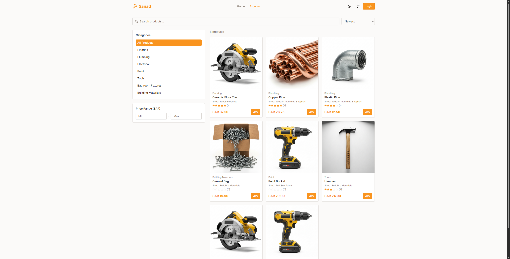
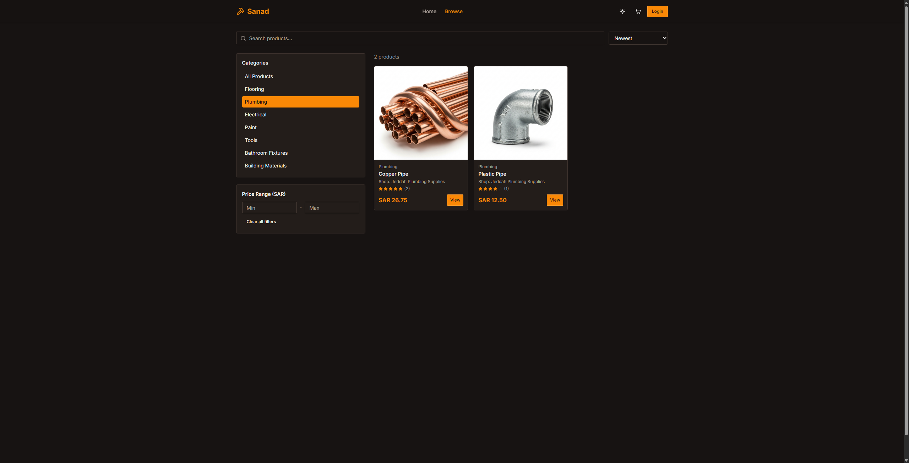
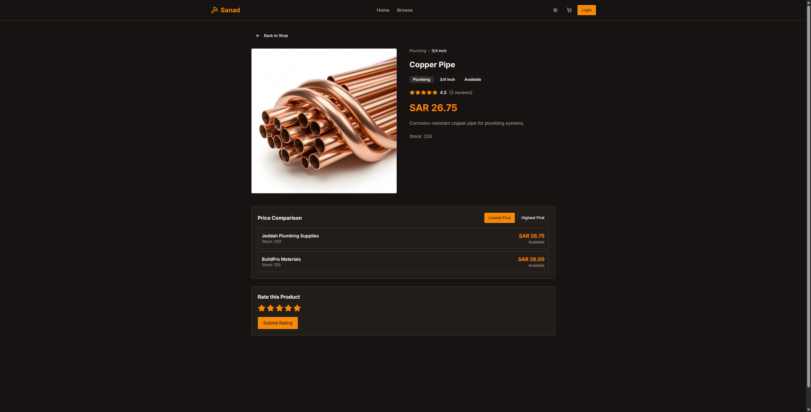

# Project Sanad سند

## Description

Project Sanad is a building-material marketplace prototype for comparing product prices across multiple shops. It includes a Spring Boot backend API, a React + Vite frontend, and PostgreSQL database setup with Flyway migrations and seed data.

## Features
- User registration and login for customers and shop owners
- Product browsing with search, category, price, availability, and rating filters
- Price comparison across shop offers
- Product detail pages with offer lists
- Rating-only review system with review summaries (requires an account to submit reviews)
- Seeded data for products, shops, categories, users, and reviews
- Docker Compose setup for frontend, backend, and PostgreSQL

## Usage

To build and run the app, use Docker Compose (Recommended Setup):

```shell
docker compose up -d
```

For local development without Docker:

```shell
mvn spring-boot:run

cd frontend
npm install
npm run dev
```

## Screenshots

### Home Page

Home page showcasing the main features of the marketplace, including product search and category browsing.


### Products Pages

Light theme and dark theme views of the products pages, showcasing the product listing with filters and price comparison features.








## The use of generative AI tools

We used OpenAI ChatGPT 5.5, 5.3-Codex, and Google Gemini 3 Pro models as assistive tools for this project. The tools were only used for refactoring our code, refactoring the repository structure, and helping us figure out some hurdles on the way (such as, if using a specific design pattern would improve the efficiency of the provided feature/code).

At no point in time was generative AI used to complete code without our direct involvement, or generate multiple files at a time filled with written code.

All generative AI output was checked, edited, and approved by our team.

Some examples of how we used generative AI tools include:

Google Gemini 3 Pro, 20/04/2026, "Can you give me the general structure of what the factory method will look like? in terms of classes and methods."

Google Gemini 3 Pro, 22/04/2026, "Is this implementation of the composite design pattern correct? [attached code]"

OpenAI ChatGPT 5.5, 27/04/2026, "Ok well before anything, here is the Kanban Board attached to this message.
We chose a creational design pattern for the Accounts feature, and a structural design pattern for the categories feature.
We have to implement a behavioral design pattern, but we still haven't decided where to implement it (for which feature I mean).
I have attached all the design patterns we can use for the project, but if there is a better way without using design patterns, we're open to it. Just know that we're required to have 1 of each creational, structural, and behavioral design pattern. [attached 2 images]"

OpenAI 5.3-Codex, 12/05/2026, "Instead of the nested loops, could we use HashMaps/HashSets to compare? In the files HighestPriceStrategy.java and LowestPriceStrategy.java. Don't write code into the files, just think and analyze."

OpenAI 5.3-Codex, 20/05/2026, "Implement at least 95% unit test coverage. Do not modify any other files, unless needed. [attached whole project codebase]"

## License

MIT License

Copyright (c) 2026, Sanad Team

Permission is hereby granted, free of charge, to any person obtaining a copy
of this software and associated documentation files (the "Software"), to deal
in the Software without restriction, including without limitation the rights
to use, copy, modify, merge, publish, distribute, sublicense, and/or sell
copies of the Software, and to permit persons to whom the Software is
furnished to do so, subject to the following conditions:

The above copyright notice and this permission notice shall be included in all
copies or substantial portions of the Software.

THE SOFTWARE IS PROVIDED "AS IS", WITHOUT WARRANTY OF ANY KIND, EXPRESS OR
IMPLIED, INCLUDING BUT NOT LIMITED TO THE WARRANTIES OF MERCHANTABILITY,
FITNESS FOR A PARTICULAR PURPOSE AND NONINFRINGEMENT. IN NO EVENT SHALL THE
AUTHORS OR COPYRIGHT HOLDERS BE LIABLE FOR ANY CLAIM, DAMAGES OR OTHER
LIABILITY, WHETHER IN AN ACTION OF CONTRACT, TORT OR OTHERWISE, ARISING FROM,
OUT OF OR IN CONNECTION WITH THE SOFTWARE OR THE USE OR OTHER DEALINGS IN THE
SOFTWARE.